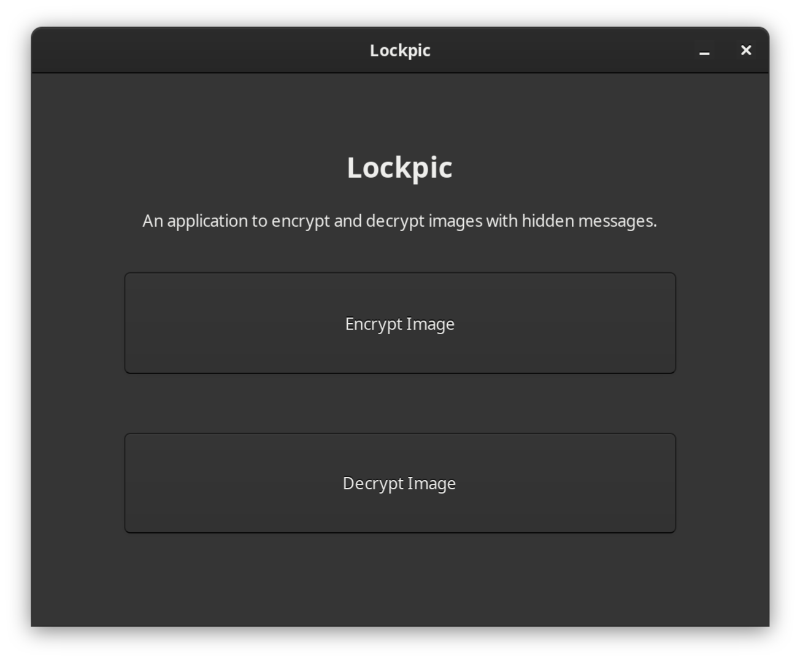
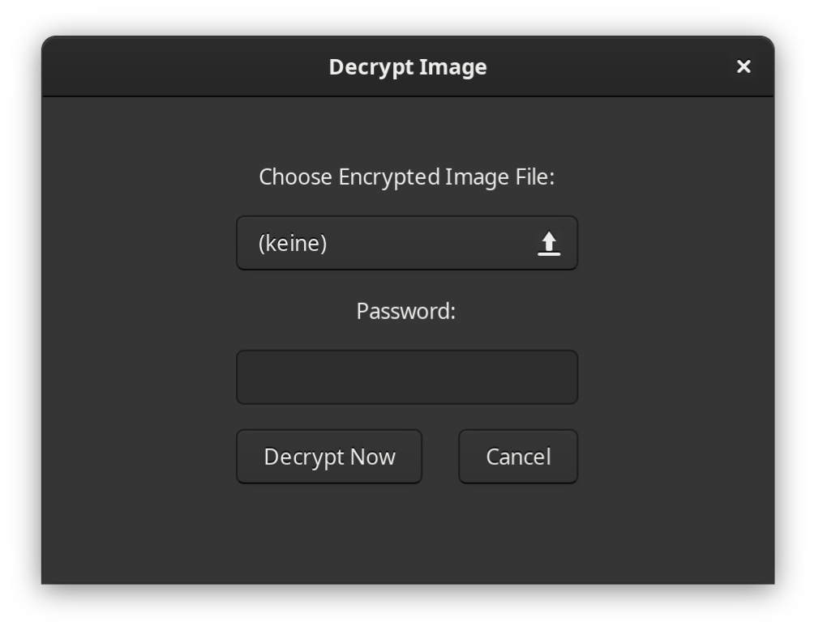

# Lockpic - Image Encryption App

Lockpic is a simple and user-friendly application designed to **encrypt and hide messages in images using steganography**. The app allows you to encrypt a message with AES encryption and then hide the encrypted message in the least significant bits (LSB) of an image file (PNG). It also enables you to decrypt the hidden message from an encrypted image when provided with the correct password.

## Features

- **Encrypt and Hide Messages in Images**: Encrypt your messages using AES encryption and hide them in the least significant bits of an image (LSB steganography).
- **Decrypt Hidden Messages**: Extract and decrypt messages from encrypted images with the correct password.
- **Graphical User Interface**: Built with GTK 3, providing an intuitive interface for all desktop enviroments.
- **Password-Based Encryption**: Secure your messages with a password using PBKDF2 to derive a secure AES encryption key.
- **Supports PNG Images**: Works with PNG images for both encrypted and decrypted results.

## Security

- **AES-GCM Encryption**: Lockpic uses AES encryption in GCM mode for strong confidentiality and integrity checks on the hidden message.
- **PBKDF2 Key Derivation**: The password is used to derive a secure encryption key via PBKDF2 with SHA-256 to ensure a strong key.

## Running the App
Download the binary file from the "Releases" section. If it does not run check if it is set to executable (right click on "Proprities" and toggle the executable switch).

## Contributions

Contributions are welcome! Feel free to fork the repository, open issues, and submit pull requests.
